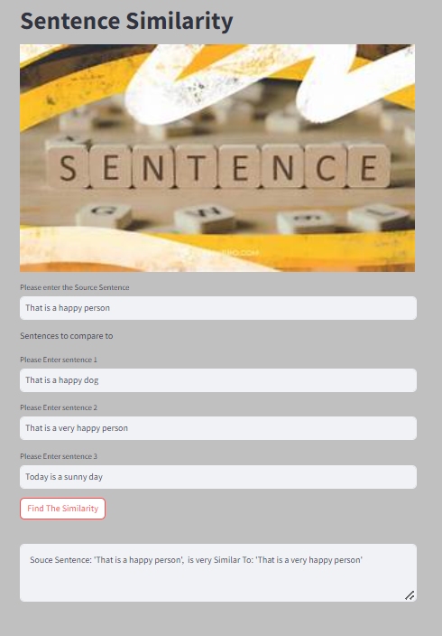

# Sentence-Similarity

Hugging Face - sentence-transformers/all-MiniLM-L6-v2: 🧠
Deep Learning: 🤖
Text Embeddings: 📏
Semantic Search: 🔍
Model Inference: 🧩

# Table of Contents

- [Overview](#overview)
- [Installation](#Installation)
- [Usage](#Usage)
- [Contribution](#contribution)
- [License](#license)
- [Contact](#contact)

## Overview 
**Sentence Similarity**
Sentence Similarity is the task of determining how similar two texts are. Sentence similarity models convert input texts into vectors (embeddings) that capture semantic information and calculate how close (similar) they are between them. This task is particularly useful for information retrieval and clustering/grouping.


**Semantic Textual Similarity**
Semantic Textual Similarity is the task of evaluating how similar two texts are in terms of meaning. 
These models take a source sentence and a list of sentences in which we will look for similarities and will return a list of similarity scores



## Installation

1. Clone this repository to your build machine using:

```bash
  git clone https://github.com/alexvatti/Sentence-Similarity.git
```
2. Navigate to the project directory:

```bash
  cd Sentence-Similarity
```
3. Install the required dependencies using pip:

```bash
  pip install -r requirements.txt
```


## Usage

1. Run the Streamlit app by executing:
```bash
cd App
streamlit run app_Code.py
```

```bash
cd App
create .env file copy & Paste the HF Access Tokens, 
SECRET_KEY=XXXXXXXXXXXXXXXXXXXXXXXXXXXXXXXXXXXXXXXX
streamlit run app_API.py
```

2.The web app will open in your browser where you can upload the Image - It will caption/describe the Image

## Contribution

Feel free to contribute and enhance the project!

## License
This project is licensed under the [MIT License](LICENSE).

## Contact
For any inquiries or issues, please contact Alex at alexvatti@gmail.com
